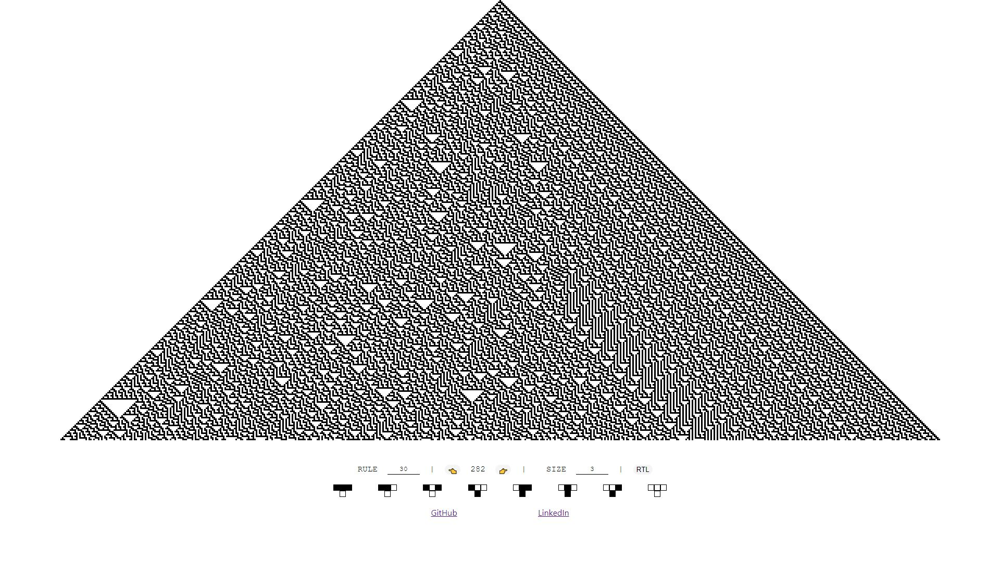

# Elementary cellular automaton

Simple & Naive ( Also Buggy & little bit slow :D ) interactive implementation of Single one cellular automaton with React. if you want read more about this check out this [WikiPedia](https://en.wikipedia.org/wiki/Elementary_cellular_automaton) page.
all you have to do is set:

- Rule
- row number
- Cell size
to enjoy this art created by simple rules ;)
